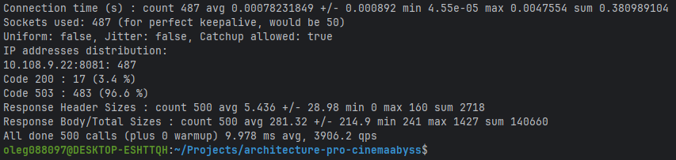
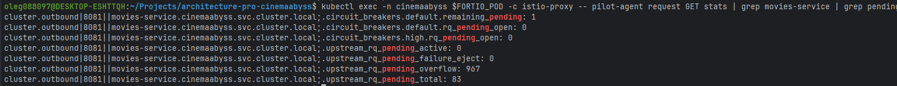

## Изучите [README.md](README.md) файл и структуру проекта.

## Задание 1

## Задание 2

### 1. Proxy

[proxy](src/microservices/proxy)

### 2. Kafka

## Задание 3

Команда начала переезд в Kubernetes для лучшего масштабирования и повышения надежности. 
Вам, как архитектору осталось самое сложное:
 - реализовать CI/CD для сборки прокси сервиса
 - реализовать необходимые конфигурационные файлы для переключения трафика.

### CI/CD

[api-tests.yml](.github/workflows/api-tests.yml)

### Proxy в Kubernetes

#### Шаг 1

#### Шаг 2

[events-service.yaml](src/kubernetes/events-service.yaml)
[proxy-service.yaml](src/kubernetes/proxy-service.yaml)
[ingress.yaml](src/kubernetes/ingress.yaml)

#### Шаг 3

## Задание 4

[helm/values.yaml](src/kubernetes/helm/values.yaml)
[helm/templates/services/events-service.yaml](src/kubernetes/helm/templates/services/events-service.yaml)
[helm/templates/services/proxy-service.yaml](src/kubernetes/helm/templates/services/proxy-service.yaml)

# Задание 5

