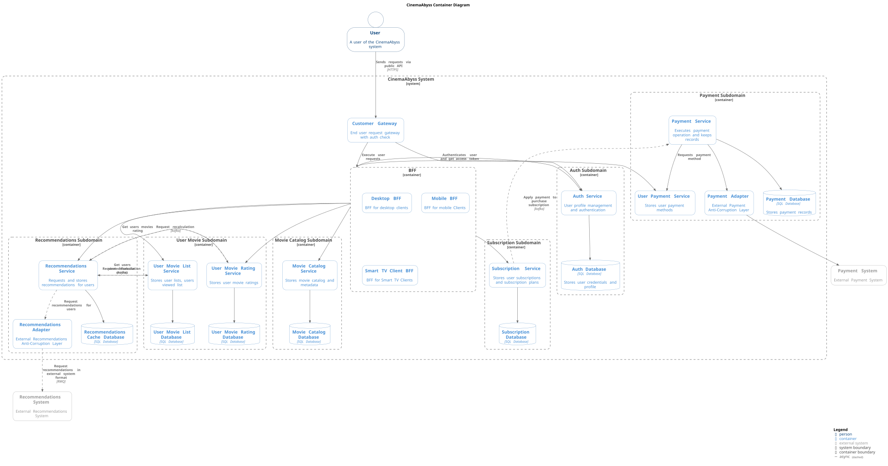
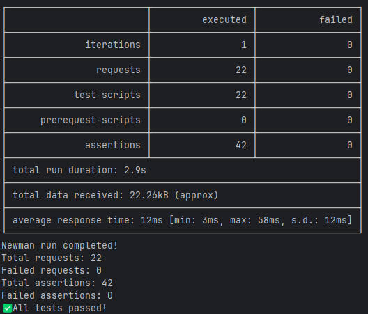
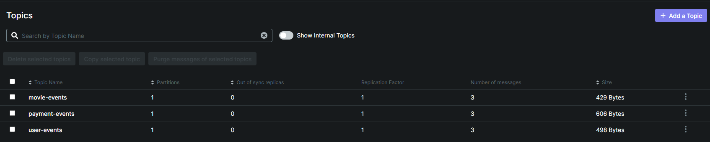
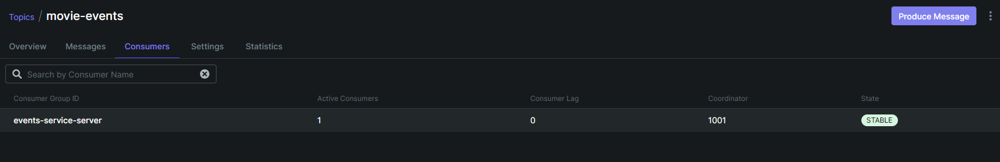
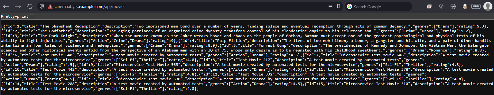
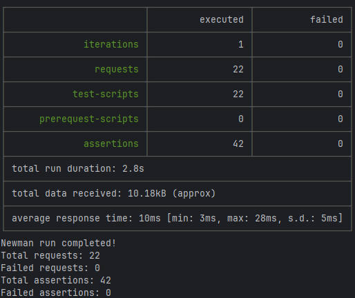
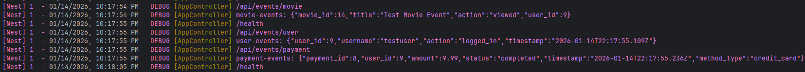
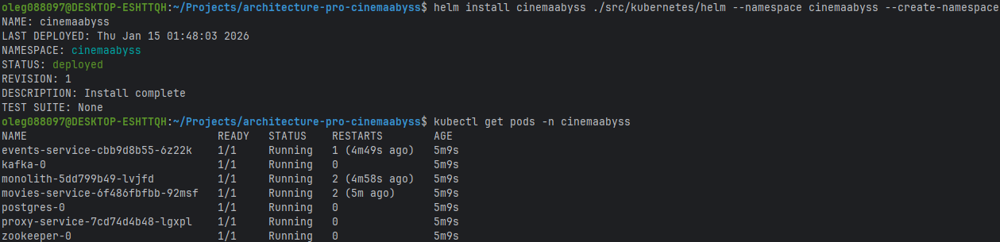
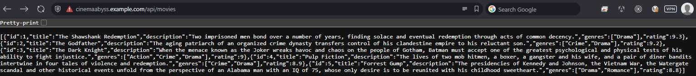

## Изучите [README.md](README.md) файл и структуру проекта.

## Задание 1




## Задание 2

### 1. Proxy

[proxy](src/microservices/proxy)

### 2. Kafka








## Задание 3

Команда начала переезд в Kubernetes для лучшего масштабирования и повышения надежности. 
Вам, как архитектору осталось самое сложное:
 - реализовать CI/CD для сборки прокси сервиса
 - реализовать необходимые конфигурационные файлы для переключения трафика.


### CI/CD

[api-tests.yml](.github/workflows/api-tests.yml)

### Proxy в Kubernetes

#### Шаг 1

#### Шаг 2

[events-service.yaml](src/kubernetes/events-service.yaml)
[proxy-service.yaml](src/kubernetes/proxy-service.yaml)
[ingress.yaml](src/kubernetes/ingress.yaml)

#### Шаг 3




## Задание 4

[helm/values.yaml](src/kubernetes/helm/values.yaml)
[helm/templates/services/events-service.yaml](src/kubernetes/helm/templates/services/events-service.yaml)
[helm/templates/services/proxy-service.yaml](src/kubernetes/helm/templates/services/proxy-service.yaml)





# Задание 5
Компания планирует активно развиваться и для повышения надежности, безопасности, реализации сетевых паттернов типа Circuit Breaker и канареечного деплоя вам как архитектору необходимо развернуть istio и настроить circuit breaker для monolith и movies сервисов.

```bash

helm repo add istio https://istio-release.storage.googleapis.com/charts
helm repo update

helm install istio-base istio/base -n istio-system --set defaultRevision=default --create-namespace
helm install istio-ingressgateway istio/gateway -n istio-system
helm install istiod istio/istiod -n istio-system --wait

helm install cinemaabyss .\src\kubernetes\helm --namespace cinemaabyss --create-namespace

kubectl label namespace cinemaabyss istio-injection=enabled --overwrite

kubectl get namespace -L istio-injection

kubectl apply -f .\src\kubernetes\circuit-breaker-config.yaml -n cinemaabyss

```

Тестирование

# fortio
```bash
kubectl apply -f https://raw.githubusercontent.com/istio/istio/release-1.25/samples/httpbin/sample-client/fortio-deploy.yaml -n cinemaabyss
```

# Get the fortio pod name
```bash
FORTIO_POD=$(kubectl get pod -n cinemaabyss | grep fortio | awk '{print $1}')

kubectl exec -n cinemaabyss $FORTIO_POD -c fortio -- fortio load -c 50 -qps 0 -n 500 -loglevel Warning http://movies-service:8081/api/movies
```
Например,

```bash
kubectl exec -n cinemaabyss fortio-deploy-b6757cbbb-7c9qg  -c fortio -- fortio load -c 50 -qps 0 -n 500 -loglevel Warning http://movies-service:8081/api/movies
```

Вывод будет типа такого

```bash
IP addresses distribution:
10.106.113.46:8081: 421
Code 200 : 79 (15.8 %)
Code 500 : 22 (4.4 %)
Code 503 : 399 (79.8 %)
```
Можно еще проверить статистику

```bash
kubectl exec -n cinemaabyss fortio-deploy-b6757cbbb-7c9qg -c istio-proxy -- pilot-agent request GET stats | grep movies-service | grep pending
```

И там смотрим 

```bash
cluster.outbound|8081||movies-service.cinemaabyss.svc.cluster.local;.upstream_rq_pending_total: 311 - столько раз срабатывал circuit breaker
You can see 21 for the upstream_rq_pending_overflow value which means 21 calls so far have been flagged for circuit breaking.
```

Приложите скриншот работы circuit breaker'а

Удаляем все
```bash
istioctl uninstall --purge
kubectl delete namespace istio-system
kubectl delete all --all -n cinemaabyss
kubectl delete namespace cinemaabyss
```
